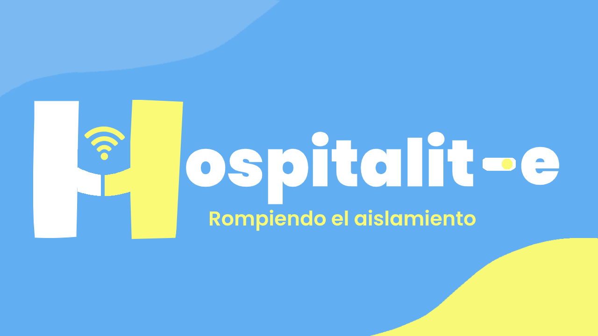

# Hospitalit-e



Hospitalit-e: acompañamiento telemático en hospitales y residencias.

Conectemos a personas que estén hospitalizadas o aisladas en residencias, con personas sanas que altruistamente se ofrezcan a hacer una videollamada para hablar con ellos y aliviar su soledad y su pena. Los infectados por el COVID-19 tienen que vivir la enfermedad aislados y alejados de sus familiares. Aunque la tecnología móvil de hoy en día permite el contacto con la familia en muchos casos, estas personas siguen pasando parte de su día en soledad. ¿Cómo podemos ayudarles y apoyarles en esta difícil situación? De manera voluntaria, las personas sanas podrán contactar por videollamada con estos enfermos para ayudarles a vencer tanto a la soledad como al virus con la mejor medicina: la palabra, el acompañamiento y el cariño. Esto podrá lograrse mediante una página web o una aplicación que ponga en contacto a ambos grupos para que posteriormente puedan establecer la videollamada a través de plataformas ya existentes como Skype, FaceTime o WhatsApp.  

¡Hagamos que su aislamiento no sea sinónimo de soledad!Hospitalit-e: acompañamiento telemático en hospitales y residencias.

Conectemos a personas que estén hospitalizadas o aisladas en residencias, con personas sanas que altruistamente se ofrezcan a hacer una videollamada para hablar con ellos y aliviar su soledad y su pena. Los infectados por el COVID-19 tienen que vivir la enfermedad aislados y alejados de sus familiares. Aunque la tecnología móvil de hoy en día permite el contacto con la familia en muchos casos, estas personas siguen pasando parte de su día en soledad. ¿Cómo podemos ayudarles y apoyarles en esta difícil situación? De manera voluntaria, las personas sanas podrán contactar por videollamada con estos enfermos para ayudarles a vencer tanto a la soledad como al virus con la mejor medicina: la palabra, el acompañamiento y el cariño. Esto podrá lograrse mediante una página web o una aplicación que ponga en contacto a ambos grupos para que posteriormente puedan establecer la videollamada a través de plataformas ya existentes como Skype, FaceTime o WhatsApp.  

¡Hagamos que su aislamiento no sea sinónimo de soledad!

# Instalación
Debe tener tanto docker como docker-compose instalado. Basta con ejecutar:

```
docker-compose up -d --build
```

Después, para crear las bases de datos y generar los documentos necesarios:
```
docker-compose exec web python manage.py makemigrations hospitalite
docker-compose exec web python hospitalite/manage.py migrate hospitalite
docker-compose exec web python hospitalite/manage.py migrate
```

Por último, creamos el superusuario:

```
docker-compose exec web python hospitalite/manage.py createsuperuser
```

Ya está todo listo para acceder en cualquier navegador a http://127.0.0.1:8000/